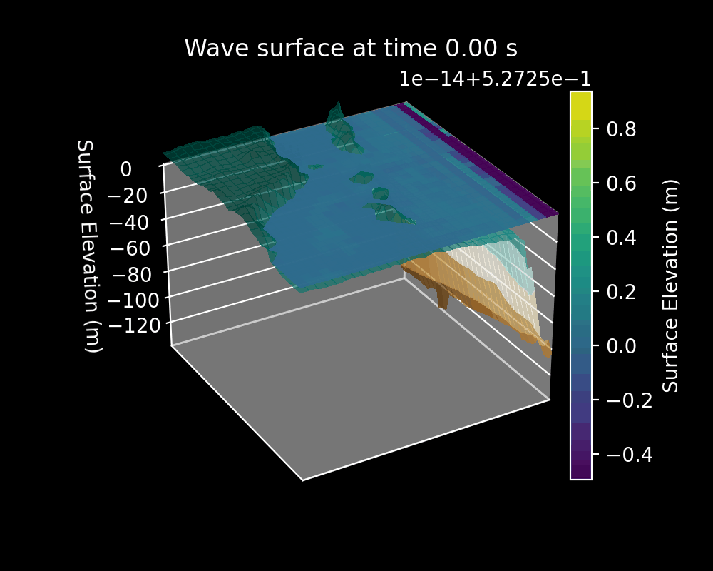
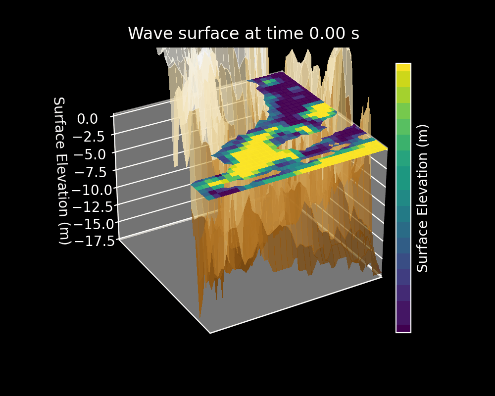
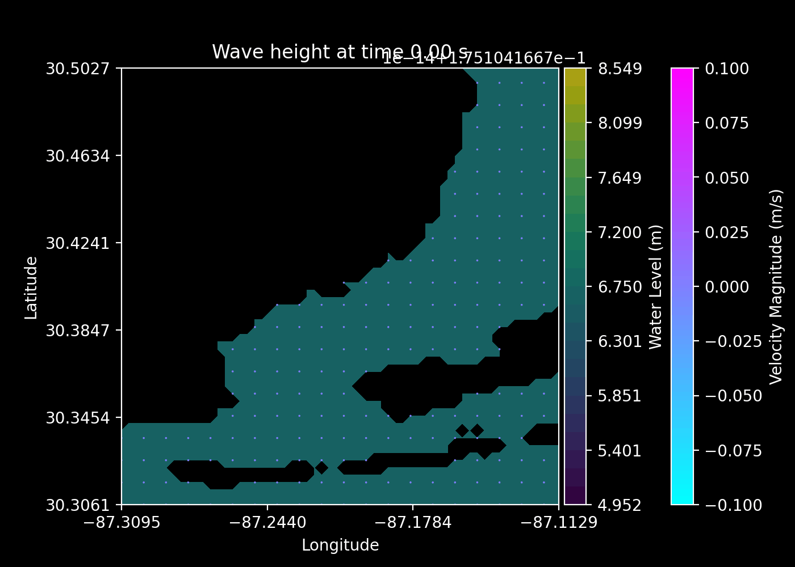
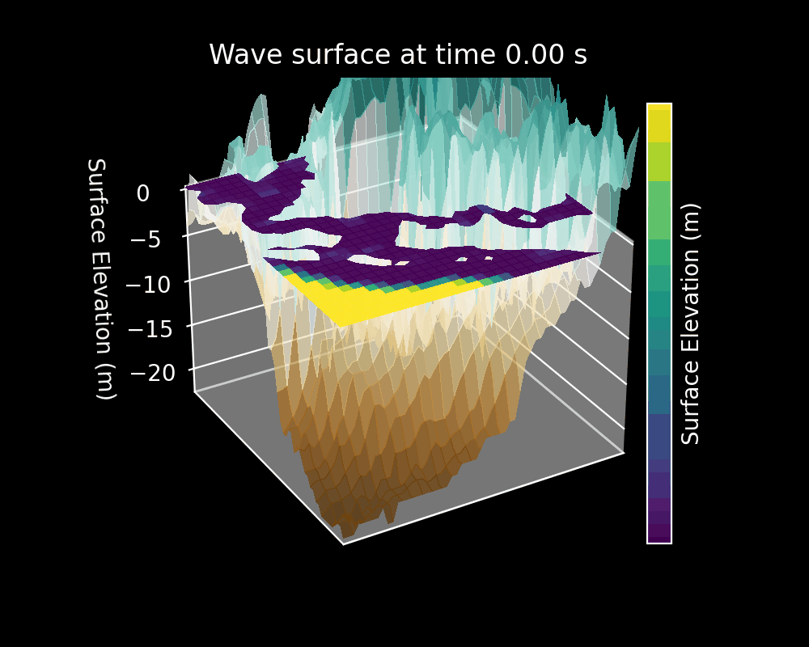
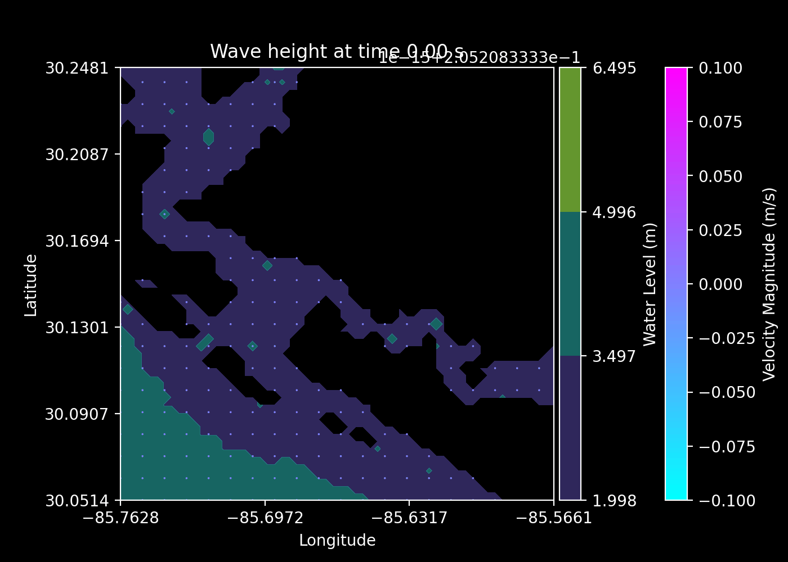
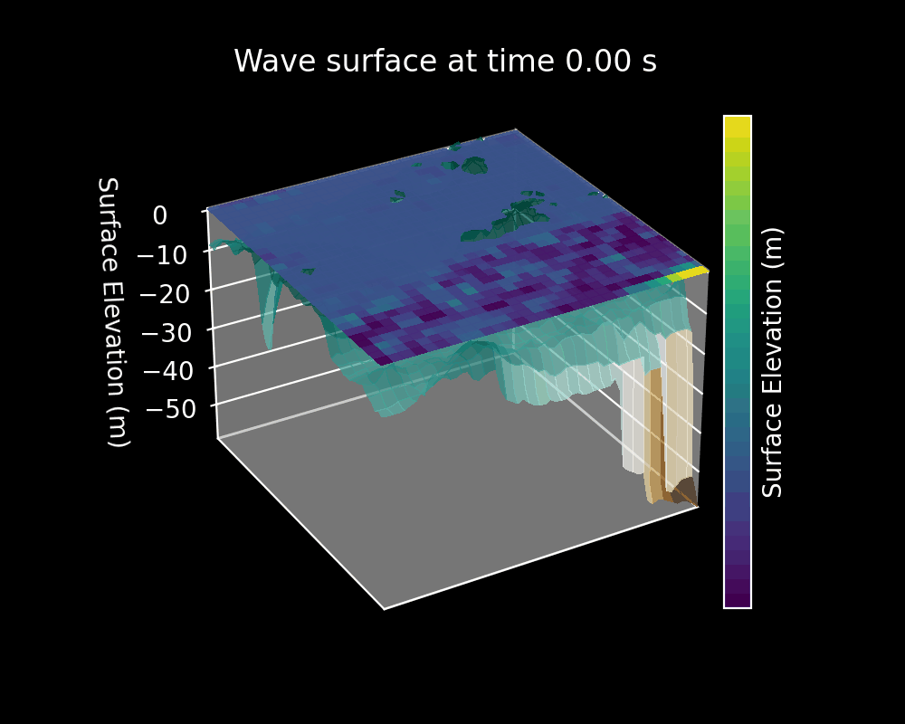
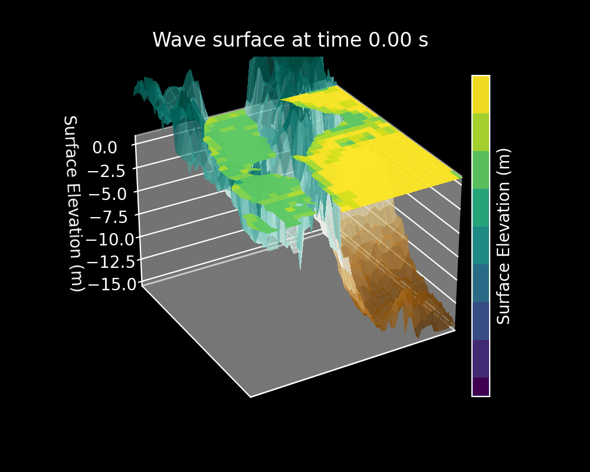
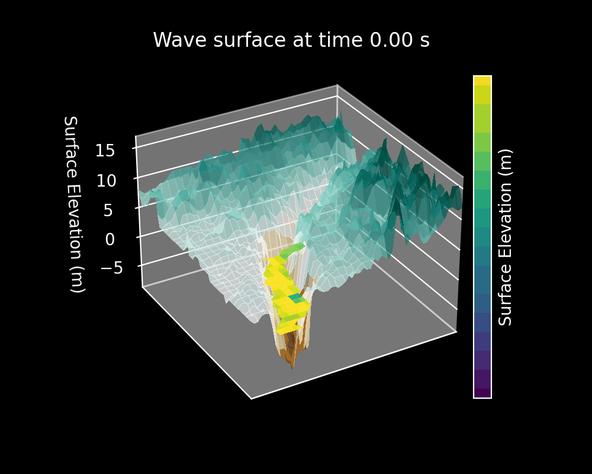
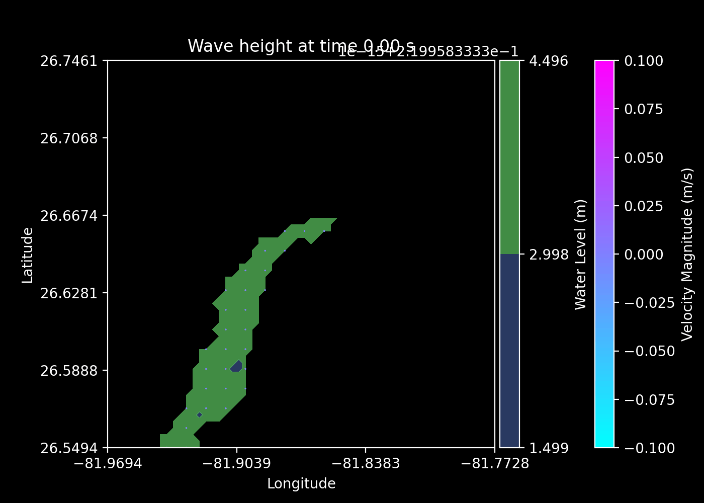

# PhysRAG-SWE

[](https://www.python.org/downloads/)
[](https://opensource.org/licenses/MIT)
[](https://github.com/psf/black)
[]()

A Python-based physics-informed retrieval-augmented generation (RAG) framework for 2D Shallow Water Equations (SWE) simulations. PhysRAG-SWE provides **automatic data retrieval and preprocessing** for TidalFlow-SWE, integrating GEBCO bathymetry data retrieval, sparse data interpolation, and CSV filtering. Together with TidalFlow's PyClaw-based SWE solver, it enables rapid modeling of storm surge, tsunami propagation, and coastal flooding scenarios.

## Features

### PhysRAG-SWE (Data Retrieval & Preprocessing)
- ✅ **Automatic Bathymetry Retrieval** — Download GEBCO data via OPeNDAP or local NetCDF
- ✅ **Geospatial Data Filtering** — Extract CSV observations by geographic and temporal extent
- ✅ **Sparse Data Interpolation** — RBF and kriging methods for point measurements
- ✅ **TidalFlow Integration** — Adapters to seamlessly integrate data into TidalFlow solvers
- ✅ **Data Caching** — Efficient local storage of retrieved bathymetry and observations

### TidalFlow-SWE (Solver Engine, Required)
- ✅ **2D Shallow Water Equations Solver** — Roe-type Riemann solver with bathymetric source terms
- ✅ **Real Bathymetry Support** — Automatic integration of GEBCO data into simulations
- ✅ **Wind Forcing** — Hurricane and storm surge simulations
- ✅ **MPI Parallelization** — Distribute computations across multiple processors
- ✅ **Configuration Management** — YAML/JSON-based configuration with validation
- ✅ **Visualization Tools** — Animation and 2D/3D plotting utilities
- ✅ **Production-Ready** — Tested on real coastal domains with validation data

---

## Simulation Demos

Pre-computed example solutions for four major coastal regions. Visualizations show water surface elevation (left) and velocity fields (right) from complete SWE simulations.

| Location | Water Surface Elevation | Velocity Field |
|:---:|:---:|:---:|
| **Virginia Key** |  |  |
| **Pensacola** |  |  |
| **Panama City** |  |  |
| **Key West** |  |  |
| **Port Canaveral** |  |  |
| **Fort Myers** |  |  |


---

## Table of Contents

### 🚀 Getting Started
- [Simulation Demos](#simulation-demos)
- [Installation](#installation)
  - [Setup Environment](#1-create-and-activate-conda-environment)
  - [Install Package](#2-install-from-source)
  - [Development Mode](#3-development-install-editable-optional)
- [Quick Start](#quick-start)
  - [Bathymetry Retrieval](#example-1-automatic-bathymetry-retrieval)
  - [Data Filtering](#example-2-geospatial-data-filtering)
  - [SWE Simulation](#example-3-swe-simulation-with-real-bathymetry)

### 📚 Documentation & API Reference
- [Architecture Overview](#architecture-overview)
- [Use Cases](#use-cases)
- [How It Compares](#how-it-compares)
- [Configuration Guide](#configuration)
- [Class Reference](#class-reference)
  - [Data Provider Documentation](docs/classes/data_providers.md)
  - [Bathymetry Retrieval Documentation](docs/classes/bathymetry.md)
  - [Data Interpolation Documentation](docs/classes/data_interpolation.md)
  - [SWE Solver Integration](docs/classes/swe_solver.md)
  - [SWE Result Documentation](docs/classes/swe_result.md)
- [Getting Started Guide](docs/getting-started.md)
- [Architecture Guide](docs/architecture.md)

### 💡 Usage & Examples
- [Complete Examples](#complete-examples)
  - [Bathymetry Retrieval](#example-1-automatic-bathymetry-retrieval-1)
  - [Data Filtering](#example-2-geospatial-data-filtering-1)
  - [Simulation Integration](#example-3-complete-swe-simulation)
  - [Visualization](#example-4-visualization-and-analysis)
- [Data Requirements](#data-requirements)
- [Utilities](#utilities)

### 🔬 Advanced Topics
- [Physics](#physics)
- [Developer Guides](docs/guides.md)
- [Tips and Best Practices](#tips-and-best-practices)
- [Troubleshooting](#troubleshooting)
- [Performance Optimization](#performance-optimization)

### 📁 Reference
- [Architecture Overview](#architecture-overview)
- [Project Structure](#project-structure)
- [References](#references)
- [Contributing](#contributing)
- [Citation](#citation)
- [License](#license)

---

## Architecture Overview

PhysRAG-SWE and TidalFlow-SWE work together in a layered architecture:
- **PhysRAG (Preprocessing Layer)**: Automatic data retrieval, filtering, and interpolation
- **TidalFlow (Solver Layer)**: Physics-based simulator

```
┌─────────────────────────────────── PhysRAG Layer ───────────────────────────────┐
│                                                                                  │
│  ┌──────────────────────────────────────────────────────────────────────────┐   │
│  │ Data Retrieval & Preprocessing                                           │   │
│  │  ├─ GEBCO Bathymetry Retrieval (OPeNDAP/NetCDF)                         │   │
│  │  ├─ CSV Geographic & Temporal Filtering                                 │   │
│  │  ├─ Sparse Data Interpolation (RBF/Kriging)                            │   │
│  │  └─ Data Validation & Caching                                           │   │
│  └────────────────┬─────────────────────────────────────────────────────────┘   │
│                  │                                                               │
│                  │ (Adapters to TidalFlow Provider Interfaces)                   │
│                  ▼                                                               │
│  ┌──────────────────────────────────────────────────────────────────────────┐   │
│  │ Integration Layer                                                        │   │
│  │  ├─ BathymetryFromGEBCO (TidalFlow BathymetryProvider)                 │   │
│  │  ├─ InitialConditionInterpolationProvider                              │   │
│  │  └─ WindProviderInterpolationProvider                                   │   │
│  └────────────────┬─────────────────────────────────────────────────────────┘   │
└───────────────────┼──────────────────────────────────────────────────────────────┘
                    │
                    ▼
┌───────────────────────────────── TidalFlow Layer ──────────────────────────────┐
│                                                                                │
│  SimulationConfig (Domain, Time, Physics Parameters)                          │
│           │                                                                    │
│           ▼                                                                    │
│  ┌──────────────────────────────────────────────────────────────────────┐    │
│  │ SWESolver ─ Integrates PyClaw + SWE Physics                          │    │
│  │  ├─ Geographic Coordinate Mapping                                    │    │
│  │  ├─ Riemann Solver (Roe-type, Bathymetric Source Terms)            │    │
│  │  ├─ Wind Forcing Integration (Hurricane/Storm)                      │    │
│  │  ├─ MPI Parallelization (Distributed Computing)                     │    │
│  │  └─ Output Management (PyClaw format)                               │    │
│  └────────────────┬─────────────────────────────────────────────────────┘    │
│                   ▼                                                            │
│  ┌──────────────────────────────────────────────────────────────────────┐    │
│  │ Visualization & Analysis (TidalFlow Utils)                           │    │
│  │  ├─ 2D Animations with Cartopy                                       │    │
│  │  ├─ 3D Surface Plots                                                 │    │
│  │  └─ Result Serialization & Loading                                   │    │
│  └──────────────────────────────────────────────────────────────────────┘    │
└──────────────────────────────────────────────────────────────────────────────┘
```

---

## Use Cases

PhysRAG-SWE is designed for a wide range of coastal and hydrodynamic applications:

🌊 **Storm Surge Prediction** — Simulate hurricane-driven water rise with real bathymetry and wind data for emergency preparedness and risk assessment

🌍 **Tsunami Modeling** — Track wave propagation from seismic events and assess coastal vulnerability using realistic ocean bathymetry

🏘️ **Flood Risk Assessment** — Evaluate inundation hazards for critical infrastructure and urban planning with high-resolution simulations

⛑️ **Coastal Protection Design** — Model effectiveness of sea walls, barriers, and other protective structures against storm surge

💧 **Hydrodynamic Studies** — General shallow water flow problems in estuaries, harbors, and coastal zones with data assimilation

🔬 **Research & Education** — Educational tool for understanding finite volume methods, shallow water physics, and data-driven modeling

📊 **Data Integration** — Combine sparse field observations with physics-based simulations for improved accuracy

---

## How It Compares

| Feature | PhysRAG-SWE | TidalFlow-SWE | ADCIRC |
|---------|:--:|:--:|:--:|
| Python-based | ✅ | ✅ | ❌ |
| Geographic coordinates | — | ✅ | ✅ |
| MPI Parallelization | — | ✅ | ✅ |
| Wind forcing | — | ✅ | ✅ |
| Real bathymetry (GEBCO) | ✅ | ✅ | ✅ |
| **Automatic bathymetry retrieval** | **✅** | ⚠️ | ⚠️ |
| **Data interpolation tools** | **✅** | ❌ | ❌ |
| **CSV data filtering** | **✅** | ❌ | ❌ |
| Visualization tools | — | ✅ | ⚠️ |
| Configuration management | — | ✅ | ❌ |
| Data assimilation ready | ✅ | ⚠️ | ✅ |
| Easy integration | ⭐⭐⭐⭐⭐ | ⭐⭐⭐⭐ | ⭐⭐ |

**Note:** Blank cells indicate features are handled by the other package. PhysRAG-SWE and TidalFlow-SWE are complementary:
- **PhysRAG**: Automatic data retrieval, interpolation, and preprocessing
- **TidalFlow**: Physics solver, simulation, and analysis

---

## Installation

> [!IMPORTANT]
> **TidalFlow-SWE is a required dependency.** PhysRAG-SWE acts as a data retrieval and preprocessing layer that feeds into TidalFlow's SWE solver. Follow the installation guide in the [TidalFlow-SWE repository](https://github.com/xioeng/TidalFlow-SWE) **first**, then proceed with PhysRAG-SWE installation.

### 1) Set up conda environment

Create and activate the conda environment (created when installing TidalFlow-SWE):

```bash
conda env create -f environment.yml
conda activate physrag-swe
```

### 2) Install PhysRAG-SWE from source

After TidalFlow-SWE is installed and the environment is activated:

```bash
git clone https://github.com/Xioeng/physrag-swe.git
cd physrag-swe
pip install -r requirements.txt
pip install .
```

### 3) Development install (editable, optional)

Use editable mode while developing the package:

```bash
pip install -r requirements.txt
pip install -e .
```

> [!TIP]
> For development, use editable install with `pip install -e .` so your changes take effect immediately without reinstalling.

---

## Quick Start

### Example 1: Automatic Bathymetry Retrieval

Retrieve GEBCO bathymetry data for a coastal region:

```python
import physrag
import numpy as np

# Download GEBCO bathymetry via OPeNDAP
extent = (-80.1865, -80.0791, 25.6678, 25.9137)  # lon_min, lon_max, lat_min, lat_max
bathymetry_df = physrag.bathymetry_retrieval.download_gebco_ascii(
    extent=extent
)

print(f"Downloaded {len(bathymetry_df)} bathymetry points")
print(bathymetry_df.head())
```

### Example 2: Geospatial Data Filtering

Filter observational data (tide gauges, buoys) by geographic extent:

```python
import physrag

# Filter CSV observations by extent
observations = physrag.rag_data_retrieval.read_csv_extent(
    csv_path="data/tide_gauges.csv",
    extent=(-80.2, -80.0, 25.6, 25.95),
    lat_col="latitude",
    lon_col="longitude",
    timestamp_col="timestamp",
    start_time="2023-01-01",
    end_time="2023-12-31"
)

print(f"Loaded {len(observations)} observations in domain")
```

### Example 3: SWE Simulation with Real Bathymetry

Complete end-to-end storm surge simulation:

```python
import tidalflow
import physrag
import numpy as np

# Configuration for Miami area (using TidalFlow's config)
config = tidalflow.config.SimulationConfig(
    lon_range=(-80.1865, -80.0791),
    lat_range=(25.6678, 25.9137),
    nx=40,
    ny=40,
    t_final=1000.0,
    dt=1.0,
    gravity=9.81,
    bc_lower=(1, 1),
    bc_upper=(1, 1),
    output_dir="output_simulation",
    multiple_output_times=True,
)

# Initialize solver (TidalFlow)
solver = tidalflow.solver.SWESolver(config=config)

# Use PhysRAG's bathymetry provider with TidalFlow's solver
from physrag.integrations.tidalflow_providers import BathymetryFromGEBCO

bath_provider = BathymetryFromGEBCO(
    extent=(-80.1865, -80.0791, 25.6678, 25.9137),
    keep_csv=False
)
# TidalFlow will use the provider to get bathymetry
solver.set_bathymetry_provider(bath_provider)

# Set initial condition
x, y = solver.mapper.coord_to_metric(solver.X_coord, solver.Y_coord)
h_init = 0.2 + 3.0 * np.exp(-0.00001 * ((x - 3500)**2 + y**2))
initial_condition = np.stack([h_init, np.zeros_like(h_init), np.zeros_like(h_init)], axis=0)
solver.set_initial_condition(initial_condition)

# Add hurricane wind forcing
u_wind = -17.8  # m/s (NE wind component)
v_wind = 17.8   # m/s (NE wind component)
solver.set_constant_wind_forcing(u_wind=u_wind, v_wind=v_wind)

# Run simulation
solver.setup_solver()
solutions = solver.solve()

print(f"Simulation complete! Generated {solutions.shape[0]} output frames")
```

---

## Configuration

> [!NOTE]
> The `SimulationConfig` dataclass centralizes all simulation parameters. Configuration is validated automatically in `__post_init__()` to catch errors early.

### SimulationConfig Dataclass (TidalFlow)

```python
config = tidalflow.config.SimulationConfig(
    # Domain
    lon_range=(-80.2, -80.0),      # Longitude range (degrees)
    lat_range=(25.6, 25.9),         # Latitude range (degrees)
    nx=40,                           # Grid cells in x
    ny=40,                           # Grid cells in y
    
    # Time
    t_final=1000.0,                  # Final time (seconds)
    dt=1.0,                          # Time step (seconds)
    
    # Physics
    gravity=9.81,                    # Gravitational acceleration (m/s²)
    
    # Boundary conditions
    bc_lower=(0, 1),     # Lower BCs [x, y]
    bc_upper=(1, 0),     # Upper BCs [x, y]
    
    # Output
    output_dir="_output",            # Output directory
    multiple_output_times=True,      # Multiple output times
    frame_interval=1,                # Frames between outputs
    
    # Numerical
    cfl_desired=0.9,                 # Desired CFL number
    cfl_max=1.0,                     # Maximum CFL number
)

# Validate configuration (automatic in __post_init__)
config.validate()

# Save configuration
config.save("config.json")

# Load configuration
config = tidalflow.config.SimulationConfig.load("config.json")
```

> [!IMPORTANT]
> Always ensure `lon_range[0] < lon_range[1]` and `lat_range[0] < lat_range[1]`. The `validate()` method checks these automatically.

### Boundary Conditions

Available boundary condition types:
- `'0'` — Solid wall (reflective)
- `'1'` — Extrapolation (open boundary)
- `'2'` — Periodic boundary

```python
# Example: Open ocean boundaries
bc_lower=(1, 1)
bc_upper=(1, 1)

# Example: Coastal domain with wall on west
bc_lower=(0, 1)
bc_upper=(1, 1)
```

---

## Class Reference

Detailed API documentation for each module is maintained under `docs/classes/`.

### PhysRAG Documentation
- [Data Provider Documentation](docs/classes/data_providers.md): PhysRAG data provider classes and interfaces
- [Bathymetry Retrieval Documentation](docs/classes/bathymetry.md): GEBCO download and interpolation utilities
- [Data Interpolation Documentation](docs/classes/data_interpolation.md): RBF and kriging methods for sparse data

### TidalFlow Documentation
- [SWE Solver Documentation](docs/classes/swe_solver.md): TidalFlow's SimulationConfig and SWESolver classes
- [SWE Result Documentation](docs/classes/swe_result.md): TidalFlow's result container and serialization methods

### Additional Guides
- [Getting Started Guide](docs/getting-started.md): Installation and quick start
- [Architecture Guide](docs/architecture.md): Design principles, workflow, and integration patterns

These pages are the source of truth for API details; this README keeps only high-level usage.

---

## Complete Examples

### Example 1: Automatic Bathymetry Retrieval

Download and process GEBCO bathymetry:

```python
import physrag
import numpy as np
import matplotlib.pyplot as plt

# Define domain extent
extent = (-87.23, -87.09, 30.20, 30.40)  # Gulf Shores, Alabama

# Fetch GEBCO data
bathymetry_df = physrag.bathymetry_retrieval.download_gebco_ascii(
    extent=extent
)

print(f"Retrieved {len(bathymetry_df)} bathymetry points")
print(f"Depth range: {bathymetry_df['Elevation'].min():.1f} to {bathymetry_df['Elevation'].max():.1f} m")

# Create grid and interpolate
x_grid = np.linspace(extent[0], extent[1], 100)
y_grid = np.linspace(extent[2], extent[3], 100)
X_grid, Y_grid = np.meshgrid(x_grid, y_grid)

# Interpolate using SparseDataInterpolator
interpolator = physrag.data_interpolation.SparseDataInterpolator(
    x=bathymetry_df['Longitude'].values,
    y=bathymetry_df['Latitude'].values,
    values=bathymetry_df['Elevation'].values
)

bathymetry_grid, uncertainty = interpolator.interpolate(
    X_grid.flatten(),
    Y_grid.flatten()
)
bathymetry_grid = bathymetry_grid.reshape(X_grid.shape)

# Visualize
plt.figure(figsize=(10, 8))
plt.contourf(X_grid, Y_grid, bathymetry_grid, levels=20, cmap='ocean_r')
plt.colorbar(label='Elevation (m)')
plt.xlabel('Longitude')
plt.ylabel('Latitude')
plt.title('GEBCO Bathymetry - Gulf Shores')
plt.show()
```

---

### Example 2: Geospatial Data Filtering

Filter observational data by geographic and temporal extent:

```python
import physrag
import pandas as pd

# Load tide gauge data
observations = physrag.rag_data_retrieval.read_csv_extent(
    csv_path="data/noaa_tide_gauges_2023.csv",
    extent=(-82, -79, 24, 27),  # Florida Keys region
    lat_col="latitude",
    lon_col="longitude",
    timestamp_col="timestamp",
    start_time="2023-09-01",
    end_time="2023-09-30"
)

print(f"Loaded {len(observations)} observations")
print(f"Available columns: {observations.columns.tolist()}")
print(f"Time range: {observations['timestamp'].min()} to {observations['timestamp'].max()}")

# Statistical summary
print("\nWater Level Statistics (m):")
print(observations['water_level'].describe())

# Seasonal comparison
summer = observations[observations['timestamp'].dt.month.isin([6, 7, 8])]
winter = observations[observations['timestamp'].dt.month.isin([12, 1, 2])]
print(f"\nSummer mean: {summer['water_level'].mean():.3f} m")
print(f"Winter mean: {winter['water_level'].mean():.3f} m")
```

---

### Example 3: Complete SWE Simulation

End-to-end storm surge simulation with data integration:

```python
import tidalflow
import physrag
import numpy as np
from physrag.integrations.tidalflow_providers import (
    BathymetryFromGEBCO,
    InitialConditionInterpolationProvider,
)

# Configuration for storm surge scenario (TidalFlow config)
config = tidalflow.config.SimulationConfig(
    lon_range=(-80.1865, -80.0791),
    lat_range=(25.6678, 25.9137),
    nx=60,
    ny=60,
    t_final=1800.0,  # 30 minutes
    dt=1.0,
    gravity=9.81,
    bc_lower=(1, 1),
    bc_upper=(1, 1),
    output_dir="output_storm_surge",
    multiple_output_times=True,
    frame_interval=5,
)

# Initialize TidalFlow solver
solver = tidalflow.solver.SWESolver(config=config)

# Use PhysRAG's GEBCO provider
bath_provider = BathymetryFromGEBCO(
    extent=config.lon_range + config.lat_range,
    keep_csv=False
)
solver.set_bathymetry_provider(bath_provider)

# Set initial condition from tide gauge data using PhysRAG
observations = physrag.rag_data_retrieval.read_csv_extent(
    csv_path="data/tide_observations.csv",
    extent=config.lon_range + config.lat_range,
    lat_col="latitude",
    lon_col="longitude"
)

# Use PhysRAG's interpolator to create initial condition provider
ic_provider = InitialConditionInterpolationProvider(
    lon=observations['longitude'].values,
    lat=observations['latitude'].values,
    values=observations['water_level'].values,
)
solver.set_initial_condition_provider(ic_provider)

# Add wind forcing (Category 1 Hurricane: 96 mph)
speed_mph = 96
angle_deg = 45  # Direction from NE
angle_rad = np.radians(angle_deg)
magnitude_ms = speed_mph * 0.44704
u_wind = magnitude_ms * np.cos(angle_rad)
v_wind = magnitude_ms * np.sin(angle_rad)

solver.set_constant_wind_forcing(u_wind=u_wind, v_wind=v_wind)

# Run simulation
solver.setup_solver()
solutions = solver.solve()

print(f"Simulation complete!")
print(f"Generated {solutions.shape[0]} output frames")
print(f"Solution shape: {solutions.shape}")
```

---

### Example 4: Visualization and Analysis

Analyze and visualize simulation results (using TidalFlow utilities):

```python
import tidalflow
import numpy as np
import matplotlib.pyplot as plt

# Load simulation results (TidalFlow utility)
result = tidalflow.utils.read_solutions(
    outdir="output_storm_surge",
    frames_list=None,  # Load all frames
)

solutions = result["solutions"]
bathymetry = result["bathymetry"]
lon_grid, lat_grid = result["meshgrid"]
times = result["times"]

print(f"Loaded {len(solutions)} frames")
print(f"Time range: {times[0]:.1f} to {times[-1]:.1f} seconds")

# Extract final frame
h_final = solutions[-1, 0, :, :]
hu_final = solutions[-1, 1, :, :]
hv_final = solutions[-1, 2, :, :]

# Calculate velocity
u_final = np.where(h_final > 1e-6, hu_final / h_final, 0)
v_final = np.where(h_final > 1e-6, hv_final / h_final, 0)
speed_final = np.sqrt(u_final**2 + v_final**2)

# Plot water surface elevation
fig, axes = plt.subplots(1, 2, figsize=(15, 5))

# Water depth
cf = axes[0].contourf(lon_grid, lat_grid, h_final, levels=20, cmap='Blues')
axes[0].set_xlabel('Longitude')
axes[0].set_ylabel('Latitude')
axes[0].set_title('Water Depth (m)')
plt.colorbar(cf, ax=axes[0])

# Velocity magnitude
cf = axes[1].contourf(lon_grid, lat_grid, speed_final, levels=20, cmap='RdYlBu_r')
axes[1].quiver(lon_grid[::3, ::3], lat_grid[::3, ::3],
               u_final[::3, ::3], v_final[::3, ::3])
axes[1].set_xlabel('Longitude')
axes[1].set_ylabel('Latitude')
axes[1].set_title('Velocity Field (m/s)')
plt.colorbar(cf, ax=axes[1])

plt.tight_layout()
plt.show()

# Find maximum water depth
h_max = solutions[:, 0, :, :].max(axis=(1, 2))
frame_idx_max = np.argmax(h_max)
print(f"\nMaximum water depth: {h_max[frame_idx_max]:.2f} m at t={times[frame_idx_max]:.1f} s")

# Animation (TidalFlow utility)
tidalflow.utils.animate_solution(
    output_path="output_storm_surge",
    frames=None,
    wave_treshold=1e-2,
    interval=100,
    save=False,
)
```

---

<details>
<summary><b>📂 Output Format</b> (click to expand)</summary>

## Output Format

After running a simulation, the solver creates an output directory containing:

### Files Generated

1. **`claw*.petsc`**: PyClaw solution files (PETSc binary format)
   - One file per output time
   - Contains state variables (depth, momentum) at that time

2. **`coord_meshgrid.npy`**: Grid coordinates
   - Shape: `(2, ny, nx)`
   - `[0, :, :]`: Longitude values
   - `[1, :, :]`: Latitude values

3. **`bathymetry.npy`**: Bathymetry data
   - Shape: `(ny, nx)`
   - Ocean floor depth/elevation values

4. **`config.json`**: Simulation configuration (if saved)
   - All configuration parameters in JSON format

### Reading Output Data

```python
import numpy as np
import tidalflow.utils as sim_utils

# Load saved data (TidalFlow utility)
result = sim_utils.read_solutions(outdir="output_storm_surge")

# Extract arrays
solutions = result["solutions"]    # (n_frames, 3, ny, nx)
bathymetry = result["bathymetry"]  # (ny, nx)
lon, lat = result["meshgrid"]      # (ny, nx) each
times = result["times"]            # (n_frames,)

# Access specific frame
frame_idx = 10
h = solutions[frame_idx, 0, :, :]   # Water depth
hu = solutions[frame_idx, 1, :, :]  # x-momentum
hv = solutions[frame_idx, 2, :, :]  # y-momentum

# Calculate velocities (where h > 0)
u = np.where(h > 1e-6, hu / h, 0)
v = np.where(h > 1e-6, hv / h, 0)

# Calculate free surface elevation
eta = h + bathymetry
```

</details>

---

## Utilities

### PhysRAG Data Retrieval

```python
from physrag.bathymetry_retrieval import download_gebco_ascii
from physrag.rag_data_retrieval import read_csv_extent

# Fetch GEBCO bathymetry (PhysRAG)
bathymetry_df = download_gebco_ascii(
    extent=(-80.2, -80.0, 25.6, 25.95)
)

# Filter CSV observations (PhysRAG)
observations = read_csv_extent(
    csv_path="data/observations.csv",
    extent=(-80.2, -80.0, 25.6, 25.95),
    lat_col="latitude",
    lon_col="longitude"
)
```

### PhysRAG Data Interpolation

```python
from physrag.data_interpolation import SparseDataInterpolator

# Create interpolator (PhysRAG)
interpolator = SparseDataInterpolator(
    x=observations['longitude'].values,
    y=observations['latitude'].values,
    values=observations['water_level'].values,
    method='rbf',
    rbf_function='thin_plate'
)

# Interpolate onto grid
gridded_data, uncertainty = interpolator.interpolate(
    x_grid.flatten(),
    y_grid.flatten()
)
```

### TidalFlow Visualization

```python
from tidalflow.utils import animate_solution, plot_solution, read_solutions

# Read solutions (TidalFlow)
result = read_solutions(outdir="output_dir")

# Plot single frame (TidalFlow)
plot_solution(
    output_path="output_dir",
    frame=10,
    wave_treshold=1e-2,
)

# Animate all frames (TidalFlow)
animate_solution(
    output_path="output_dir",
    frames=None,
    wave_treshold=1e-2,
    interval=100,
    save=False,
)
```

### TidalFlow Bathymetry Utilities

```python
from tidalflow.utils import interpolate_gebco_on_grid

# Load GEBCO bathymetry and interpolate to grid (TidalFlow)
bathymetry = interpolate_gebco_on_grid(
    X=lon_grid,
    Y=lat_grid,
    nc_path="data/gebco_file.nc"
)

# Handle NaN values (land or missing data)
bathymetry[np.isnan(bathymetry)] = 0.0
```

---

## Physics

TidalFlow-SWE solves the 2D shallow water equations with bathymetric source terms and wind forcing:

> [!NOTE]
> The solver uses a Roe-type Riemann solver (`shallow_roe_with_efix_2D`) with support for bathymetric source terms and wind forcing.

$$
\frac{\partial h}{\partial t} + \frac{\partial (hu)}{\partial x} + \frac{\partial (hv)}{\partial y} = 0
$$

$$
\frac{\partial (hu)}{\partial t} + \frac{\partial (hu^2 + \frac{gh^2}{2})}{\partial x} + \frac{\partial (huv)}{\partial y} = -gh\frac{\partial b}{\partial x} + \tau^x
$$

$$
\frac{\partial (hv)}{\partial t} + \frac{\partial (huv)}{\partial x} + \frac{\partial (hv^2 + \frac{gh^2}{2})}{\partial y} = -gh\frac{\partial b}{\partial y} + \tau^y
$$

Where:
- $h$: water depth (m)
- $u, v$: velocity components (m/s)
- $g$: gravitational acceleration (m/s²)
- $b$: bathymetry (bottom topography, m)
- $\tau^x, \tau^y$: wind stress terms (m²/s²)

### Wind Forcing

Wind stress is computed as:

$$
\tau^x = \frac{\rho_a c_d |U| u_{wind}}{\rho_{water}}
$$

$$
\tau^y = \frac{\rho_a c_d |U| v_{wind}}{\rho_{water}}
$$

Where:
- $\rho_a = 1.225$ kg/m³: air density
- $\rho_{water} = 1000$ kg/m³: water density
- $c_d = 1.3 \times 10^{-3}$: drag coefficient
- $U = (u_{wind}, v_{wind})$: wind velocity (m/s)

---

<details>
<summary><b>💡 Tips and Best Practices</b> (click to expand)</summary>

## Tips and Best Practices

### 1. Data Retrieval

- **GEBCO Coverage**: GEBCO data is global; check coverage before downloading
- **File Formats**: Use NetCDF format for GEBCO (fastest interpolation)
- **Extent Convention**: Use (lon_min, lon_max, lat_min, lat_max) format
- **Cache Strategy**: Save downloaded data locally to avoid repeated downloads
- **Quality Check**: Visualize retrieved bathymetry before simulation

### 2. Data Interpolation

- **Method Selection**:
  - RBF (thin-plate): Good for scattered data, slower for large datasets
  - Kriging: Good for spatial correlation, requires calibration
  - IDW: Fast but less smooth
- **Uncertainty**: Use uncertainty estimates to validate interpolation
- **Grid Density**: Balance accuracy vs. computational cost
- **Validation**: Validate against held-out observations when possible

### 3. Grid Resolution

- **Start coarse**: Begin with `nx=40, ny=40` for testing
- **Refine gradually**: Double resolution to check convergence
- **Memory consideration**: Memory usage scales as $O(nx \times ny)$
- **Typical values**: 40-200 cells per dimension

### 4. Time Step Selection

> [!WARNING]
> Violating the CFL condition (`dt` too large) will cause numerical instability and NaN values. When in doubt, reduce `dt`.

- **CFL condition**: $dt$ should satisfy Courant-Friedrichs-Lewy condition
- **Rule of thumb**: $dt \leq \frac{\min(dx, dy)}{\sqrt{g \times h_{max}}}$
- **Start conservative**: Use smaller `dt` initially (0.5-1.0 seconds)
- **Adaptive stepping**: Solver can adjust `dt` automatically

### 5. Boundary Conditions

- **Ocean boundaries**: Use `1` for open ocean boundaries
- **Coast/walls**: Use `0` for solid boundaries (coastline, islands)
- **Periodic**: Use `2` for periodic domains (rarely used)
- **Mixed conditions**: Different BCs on different edges

### 6. Initial Conditions

> [!IMPORTANT]
> Initial water depth must be positive or zero everywhere ($h \geq 0$). The solver cannot handle negative water depths. Use smooth transitions to avoid discontinuities.

- **Positive depths**: Ensure $h \geq 0$ everywhere
- **Smooth transitions**: Avoid discontinuities in initial conditions
- **Balance**: Ensure momentum is consistent with water depth
- **Dry regions**: Set $h = 0$ for initially dry land

### 7. Wind Forcing

- **Units**: Wind velocities in m/s
- **Direction convention**:
  - $u > 0$: Eastward wind
  - $v > 0$: Northward wind
- **Magnitude**: Typical values:
  - Light breeze: 5-10 m/s
  - Strong winds: 15-25 m/s
  - Hurricane: 30-70 m/s

### 8. MPI Parallelization

```bash
# Run with MPI (4 processes)
mpiexec -n 4 python your_script.py
```

- Automatically parallelized if MPI is available
- Check `solver.rank` for rank-specific operations
- Only rank 0 should do I/O and visualization
- Load balancing handled by PyClaw

### 9. Coordinate Systems

- **Geographic coordinates**: `X_coord`, `Y_coord` in degrees
- **Metric coordinates**: Use `mapper.coord_to_metric()` for distances
- **Array ordering**: Always `(ny, nx)` (row-major, latitude × longitude)
- **Bathymetry convention**: Negative = depth, Positive = elevation

### 10. Debugging

- **Validate config**: Call `config.validate()` explicitly
- **Check array shapes**: Verify `(ny, nx)` or `(3, ny, nx)` dimensions
- **Inspect bathymetry**: Plot before running simulation
- **Start simple**: Test with flat bathymetry and simple initial conditions
- **Check for NaN**: Validate bathymetry and initial condition arrays

### 11. Performance Optimization

- **Reduce output**: Set `multiple_output_times=False` for final state only
- **Increase frame_interval**: Output less frequently
- **Optimize grid**: Balance accuracy vs. computation time
- **Use MPI**: Parallelize for large domains
- **Larger dt**: Use largest stable time step

</details>

---

<details>
<summary><b>🔧 Troubleshooting</b> (click to expand)</summary>

## Troubleshooting

### Common Errors and Solutions

> [!NOTE]
> Most numerical instabilities are caused by violating the CFL condition or providing invalid initial conditions. Always validate first!

**"Configuration validation failed"**
- Check that all required parameters are set
- Ensure `lon_range[0] < lon_range[1]`
- Ensure `lat_range[0] < lat_range[1]`
- Ensure `nx, ny > 0`
- Ensure `t_final > dt > 0`

**"Bathymetry shape does not match grid dimensions"**
- Ensure bathymetry shape is `(ny, nx)`, not `(nx, ny)`
- Match `config.ny` and `config.nx` exactly

**"Initial condition shape does not match expected shape"**
- Ensure shape is `(3, ny, nx)`: `[h, hu, hv]`
- First dimension must be 3 (water depth, x-momentum, y-momentum)

**"Initial condition contains NaN values"**
- Check for NaN in input arrays
- Handle NaN in bathymetry before creating initial condition

**"Initial water depth contains negative values"**
- Ensure all $h \geq 0$ in initial condition
- Dry areas should have $h = 0$, not negative

**"ImportError: No module named 'clawpack'"**
```bash
pip install clawpack
```

**"ImportError: No module named 'physrag'"**
```bash
# Ensure package is installed in development mode
cd /path/to/physrag-swe
pip install -e .
```

**MPI errors**
```bash
# Ensure mpi4py is installed correctly
pip install --upgrade mpi4py
```

**Memory issues with large grids**
- Use MPI parallelization: `mpiexec -n 4 python script.py`
- Reduce `nx`, `ny` values
- Reduce `num_output_times` or increase `frame_interval`

**Visualization not working**
```bash
# Install matplotlib and cartopy
pip install matplotlib
conda install cartopy  # Recommended method
```

**Simulation unstable (NaN or Inf in output)**

> [!WARNING]
> This typically indicates the CFL condition was violated. Reduce `dt` immediately and verify your initial conditions are physically reasonable.

- Reduce `dt` (time step too large)
- Check initial conditions for discontinuities
- Verify bathymetry data is reasonable
- Check CFL condition: reduce `cfl_desired`

**Data retrieval fails**
- Check internet connection for OPeNDAP access
- Verify extent is within GEBCO coverage (-180° to 180° longitude)
- Ensure CSV file exists and has correct column names
- Check that column names match `lat_col`, `lon_col` parameters

**Interpolation produces NaN values**
- Ensure input data has no NaN values
- Check that grid points are within input data bounds
- Use extrapolation options if needed
- Verify input data dimensionality

</details>

---

## Project Structure

```
physrag/                                # PhysRAG Package (Data Retrieval & Preprocessing)
├── __init__.py                         # Package exports
├── utils.py                            # Utility functions (validation, helpers)
├── bathymetry_retrieval/               # GEBCO bathymetry data retrieval
│   ├── __init__.py
│   ├── retrieval.py                   # OPeNDAP/NetCDF fetching
│   ├── query.py                       # Query building
│   └── conversion.py                  # Data format conversion
├── rag_data_retrieval/                 # CSV observational data filtering
│   ├── __init__.py
│   └── csv_retrieval.py               # Geographic/temporal filtering
├── data_interpolation/                 # Sparse data interpolation
│   ├── __init__.py
│   └── sparse_interpolator.py         # RBF/Kriging methods
└── integrations/                       # Integration adapters for external solvers
    ├── __init__.py
    ├── tidalflow_providers.py         # TidalFlow provider adapters
    ├── swe_simulator_providers.py     # SWE-simulator provider adapters
    └── utils.py                        # Integration utilities

[TidalFlow-SWE]                         # External package (installed separately)
├── config.py                           # SimulationConfig dataclass
├── solver.py                           # SWESolver main class (PyClaw integration)
├── providers.py                        # Abstract provider interfaces
└── ... (other TidalFlow components)

examples/
├── examples_set.py                     # Workflows demonstrating PhysRAG + TidalFlow

data/
├── gebco_*.csv                         # Downloaded GEBCO bathymetry data
├── asv_datasets/                       # Sample validation datasets
└── florida_weather_datasets/           # Weather/tide observation data

docs/
├── getting-started.md                  # Installation & quick start
├── architecture.md                     # Design principles & workflow
├── guides.md                           # Developer guides
├── index.md                            # Documentation index
├── api.md                              # API overview
└── classes/
    ├── data_providers.md               # PhysRAG data provider classes
    ├── bathymetry.md                   # Bathymetry retrieval API
    └── data_interpolation.md           # Interpolation methods API

tests/
├── test_bathymetry_retrieval.py
├── test_data_filtering.py
├── test_data_interpolation.py
└── test_integration.py
```

---

## Data Requirements

### GEBCO Bathymetry Data

> [!IMPORTANT]
> Real bathymetry data is required for realistic coastal simulations. PhysRAG-SWE can automatically download GEBCO data via OPeNDAP or load local NetCDF files.

### Automatic Download via OPeNDAP

```python
import physrag

# GEBCO data downloaded automatically
bathymetry_df = physrag.bathymetry_retrieval.fetch_gebco_opendap(
    extent=(-80.2, -80.0, 25.6, 25.95),
    output_path="data/gebco_biscayne.csv"
)
```

### Manual Download

1. Go to https://www.gebco.net/data_and_products/gridded_bathymetry_data/
2. Select your region of interest
3. Download as **NetCDF format** (recommended)
4. Place in `data/` directory

Example filename: `gebco_2025_n25.9288_s25.6527_w-80.2016_e-80.0642.nc`

### Observational Data

Prepare observational data (tide gauges, buoys, etc.) as CSV with columns:
- `longitude`: Geographic longitude in degrees
- `latitude`: Geographic latitude in degrees
- `water_level`: Water surface elevation in meters (optional)
- `timestamp`: Date/time of measurement (optional)
- `velocity_u`, `velocity_v`: Velocity components (optional)

---

## References

- **ClawPack**: http://www.clawpack.org/
- **PyClaw Documentation**: http://www.clawpack.org/pyclaw/
- **Shallow Water Equations**: Classical 2D SWE with bathymetry
- **Riemann Solver**: Uses `shallow_roe_with_efix_2D`
- LeVeque, R. J. (2002). *Finite Volume Methods for Hyperbolic Problems*
- GEBCO Bathymetric Data: https://www.gebco.net/
- **RBF Interpolation**: Wendland, H. (2005). *Scattered Data Approximation*
- **Kriging Methods**: Cressie, N. (1993). *Statistics for Spatial Data*

---

## Contributing

We welcome contributions! Whether you have feedback on features, have encountered bugs, or have suggestions for enhancements, we'd love to hear from you.

> [!IMPORTANT]
> Your insights help us make PhysRAG-SWE more robust and user-friendly.

### How to Contribute

1. **Report Issues**: Found a bug? [Open an issue](../../issues)
2. **Feature Requests**: Have an idea? [Start a discussion](../../discussions)
3. **Pull Requests**: Ready to contribute code?
   - Fork the repository
   - Create a feature branch (`git checkout -b feature/my-feature`)
   - Commit your changes (`git commit -am 'Add my feature'`)
   - Push to the branch (`git push origin feature/my-feature`)
   - Open a Pull Request

### Areas We Need Help With

- 🧪 **Unit tests** — Expand test coverage
- 📚 **Documentation** — Improve guides and API docs
- 🎨 **Visualization** — Enhance plotting capabilities
- 🚀 **Performance** — Optimize interpolation and solver
- 🐛 **Bug fixes** — Help us squash bugs
- 📊 **Data integration** — Add support for more data sources

### Development Setup

```bash
# Clone and setup development environment
git clone https://github.com/Xioeng/physrag-swe.git
cd physrag-swe

# Create environment
conda env create -f environment.yml
conda activate physrag-swe

# Install in development mode
pip install -e ".[dev]"

# Run tests
pytest tests/

# Format code
black physrag/
isort physrag/

# Type checking
mypy physrag/
```

---

## Citation

If you use PhysRAG-SWE in your research, teaching, or applications, please cite it:

### BibTeX

```bibtex
@software{physragswe2025,
  title={PhysRAG-SWE: Physics-Informed Retrieval-Augmented Generation for Shallow Water Equations Simulations},
  author={Fuentes, Jose},
  year={2025},
  url={https://github.com/Xioeng/physrag-swe},
  license={MIT}
}
```

### APA

Fuentes, J. (2025). PhysRAG-SWE: Physics-informed retrieval-augmented generation for shallow water equations simulations. Retrieved from https://github.com/Xioeng/physrag-swe

### MLA

Fuentes, Jose. "PhysRAG-SWE: Physics-Informed Retrieval-Augmented Generation for Shallow Water Equations Simulations." GitHub, 2025, https://github.com/Xioeng/physrag-swe.

---

## License

MIT License - see LICENSE file for details.

---

